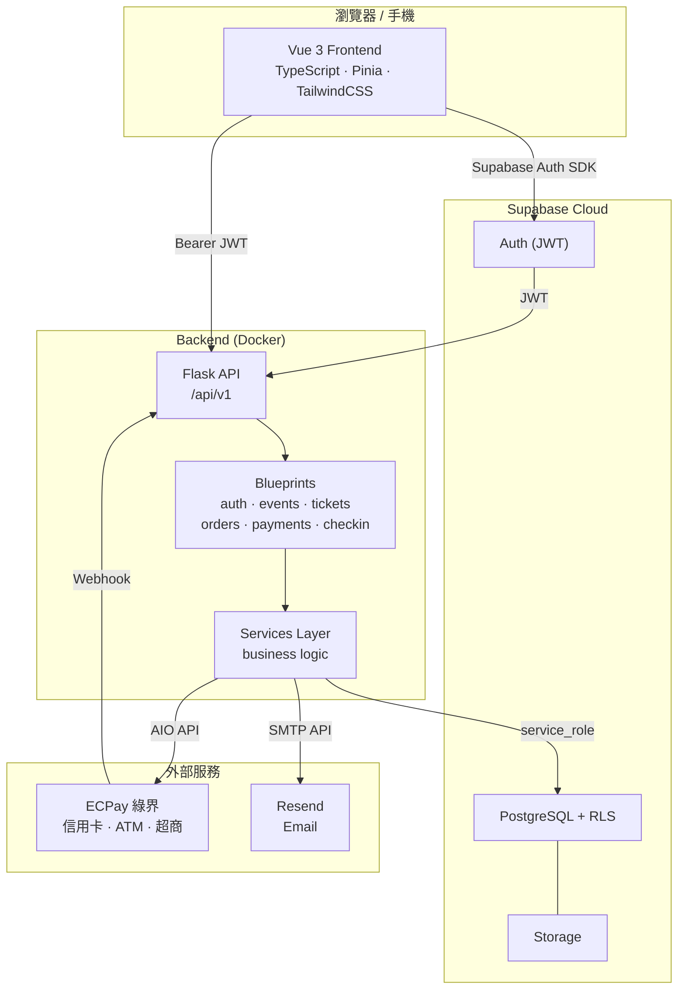

<div align="center">
  
</div>

# CypherHub

**專為街舞社群打造的活動購票平台。**

從 Cypher 到 Battle、Workshop 到 Showcase — CypherHub 讓主辦方輕鬆開活動、讓舞者一站搞定報名購票。

---

## 這是什麼？

CypherHub 是一個街舞活動整合平台，解決街舞圈長期缺乏專屬工具的痛點。不同於 Accupass、KKTIX 等通用售票平台，CypherHub 從街舞社群的需求出發：

- 支援 Cypher、Battle、Workshop、Showcase、Jam 等街舞專屬活動分類
- 內建舞風篩選（Hiphop、Popping、Locking、Breaking、Waacking⋯）
- 從報名到現場核銷的完整閉環，不需要再用 Google 表單 + LINE 群組拼湊

---

## 使用流程

### 舞者（參加者）

```
瀏覽活動 → 依舞風/類型篩選 → 查看活動詳情
    → 登入 → 選擇票種 → 填寫報名表 → 付款（或免費報名）
        → 取得 QR 電子票券 → 活動當天出示 QR 入場
```

- 在首頁依舞風（Hiphop、Popping⋯）或活動類型（Battle、Workshop⋯）找活動
- 點進活動頁查看時間、地點、票價、主辦資訊與社群連結
- 登入後選票種，填寫主辦方設定的報名表（姓名、電話、舞風等）
- 免費活動直接報名；付費活動透過綠界金流完成付款（信用卡、ATM、超商代碼）
- 報名成功後在「我的票券」頁面取得 QR Code
- 活動當天打開 QR 讓主辦方掃碼即可入場

### 主辦方

```
申請主辦 → 建立活動 → 設定票種與報名表 → 管理報名名單
    → 活動當天掃碼核銷 → 查看結算 → 申請提領
```

- 申請成為主辦方，經平台審核通過後即可建立活動
- 設定活動資訊（時間、地點、舞風標籤、流程表、社群連結）
- 建立多種票種（免費/付費、不同價格與數量限制）
- 透過表單建構器自訂報名欄位（文字、下拉選單、勾選框等）
- 邀請團隊成員協作，分配 Owner / Admin / Staff 權限
- 活動當天用手機掃描 QR 或手動輸入完成核銷
- 活動結束後查看結算明細，申請提領收入

---

## 平台特色

| | CypherHub | 通用售票平台 |
|---|---|---|
| 舞風分類 | Hiphop、Popping、Locking、Breaking 等精準篩選 | 僅「舞蹈」大分類 |
| 活動類型 | Cypher、Battle、Workshop、Showcase、Jam 專屬標籤 | 無對應分類 |
| 報名表單 | 主辦方自訂欄位，可依票種設定不同問題 | 固定格式或需外掛 |
| 核銷方式 | QR 掃碼 + 手動輸入雙模式，手機即可操作 | 多數需另購設備 |
| 團隊協作 | Owner / Admin / Staff 三級權限 | 通常僅單一管理員 |
| 費用結算 | 內建結算與提領申請 | 需另外對帳 |

---

## 目前狀態

平台已完成所有規劃開發階段：

- **MVP-1** — 免費報名 + QR 核銷 + 舞風篩選 + 自訂報名表
- **MVP-2** — 付費票種 + 綠界金流 + 訂單管理 + 退款
- **MVP-3** — 多角色權限 + 主辦方審核 + 費用結算 + 審計紀錄
- **SEC-1~4** — HTTPS 強制、CORS 收斂、Secrets 管理、Rate Limit 完善

120+ 自動化測試通過，214 項驗收項目全數完成。

---

## 系統架構



## 技術棧

| 層級 | 技術 |
|------|------|
| Backend | Python 3.12 / Flask / Pydantic v2 |
| Frontend | Vue 3 / TypeScript / Vite / TailwindCSS |
| Database | Supabase（PostgreSQL + Auth + RLS） |
| Payment | 綠界 ECPay（信用卡、ATM、超商代碼） |
| Email | Resend |
| Infra | Docker Compose / GitHub Actions CI/CD |

---

## 文件

所有開發、部署、API 文件集中在 [`docs/`](docs/) 目錄：

| 需求 | 文件 |
|------|------|
| 開發環境架設 | [docs/setup/local-cloud-switch.md](docs/setup/local-cloud-switch.md) |
| 開發規格與路線圖 | [docs/development/develop.md](docs/development/develop.md) |
| API 端點總表 | [docs/api/endpoints.md](docs/api/endpoints.md) |
| DB Schema | [docs/development/database-schema.md](docs/development/database-schema.md) |
| 環境變數清單 | [docs/development/environment-variables.md](docs/development/environment-variables.md) |
| 部署指南 | [docs/deployment/deploy-guide.md](docs/deployment/deploy-guide.md) |
| CI/CD | [docs/deployment/ci-cd.md](docs/deployment/ci-cd.md) |
| 驗收清單 | [docs/verification/acceptance-checklist.md](docs/verification/acceptance-checklist.md) |
| 完整文件索引 | [docs/verification/README.md](docs/verification/README.md) |

---

## 快速啟動

```bash
# 1. Clone
git clone https://github.com/your-org/CypherHub.git
cd CypherHub

# 2. 環境設定
cp backend/.env.example backend/.env
cp frontend/.env.example frontend/.env
# 編輯 .env 填入 Supabase keys

# 3. 啟動
docker compose -f infra/docker-compose.yml up --build
```

- Frontend: http://localhost:5173
- Backend API: http://localhost:8000/api/v1/health

詳細設定（本地 Supabase、雲端 Supabase、非 Docker 開發）請見 [docs/setup/local-cloud-switch.md](docs/setup/local-cloud-switch.md)。
