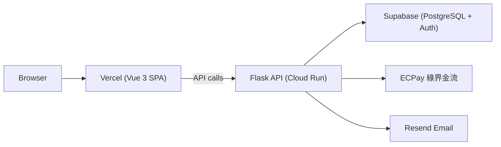

# CypherHub 作品集完整度評估

> 目標：確認此專案是否達到「讓外部 reviewer 相信開發者能接案」的標準。  
> 評估日期：2026-04-02

---

## 總體結論

**技術水平：很強，可接案。**

這個 project 做到了大多數 portfolio project 做不到的事：真實金流串接（ECPay）、無鎖超賣防護、訂單狀態機、RBAC、Audit log、結算系統、29 張 migration。這不是「練習作業」，是真實可上線的系統。

**但目前有一個致命缺口：沒有 live demo。**  
技術評審可能會讀 code，但客戶不會。他們要的是「點開網址能用的東西」。

---

## 現有亮點（不需補）

| 項目 | 說明 |
|------|------|
| 完整全端架構 | Flask + Vue 3 + Supabase + TypeScript，分層清晰 |
| 真實金流 | ECPay AIO、CheckMacValue SHA-256、Webhook 冪等驗證 |
| 庫存安全 | `FOR UPDATE` 行鎖 + DB 原子操作，不是 app 層先查再 insert |
| 訂單狀態機 | `created→holding→pending_payment→paid→issued/refunded`，有獨立 domain layer |
| RBAC | `owner/admin/staff` 三級，RLS 配合，非靠 app 層判斷 |
| 測試覆蓋 | 30+ 個測試檔，含 concurrency test、idempotency test |
| CI/CD | GitHub Actions：lint + test + build 自動跑 |
| DB Migrations | 29 張 migration，版本可追溯 |
| 完整文件 | API 文件、Schema、部署指南、環境變數清單 |
| 安全性 | JWT 驗證、RLS 全表開啟、Rate limit、CORS 設定 |

---

## 缺口清單（按優先序）

### P0：沒有 live demo（最優先）

**影響：致命。**

README 的 clone URL 還是 `your-org/CypherHub`，代表沒有公開部署。  
對任何 reviewer（不管是技術或非技術）來說，「看不到跑起來的 demo」都會打折扣。

**需要做的事：**
- 部署前端到 Vercel（免費，`npm run build` 直接推，文件已有 `docs/deployment/deploy-guide.md`）
- 部署後端到 Railway 或 Render（免費方案夠用，Dockerfile 已有）
- 後端連接 Supabase Cloud（已有 `scripts/use-cloud-supabase.sh`）
- 更新 README 的 clone URL 和 live demo 連結

---

### P1：README 沒有截圖或 demo GIF（次優先）

**影響：高。**

README 目前是純文字。reviewer 要在 10 秒內判斷這個 project 值不值得深入看，截圖是最快的方式。

**需要做的事：**
- 截 3-5 張關鍵頁面截圖：首頁活動列表、活動詳情、報名流程、QR 票券、主辦方管理後台
- 放到 `docs/screenshots/` 目錄或 GitHub issue 上傳後引用
- 在 README 的「這是什麼」段落後面加圖
- （加分）錄一個 30-60 秒的 demo GIF，用 `kap`（Mac）或 `LICEcap` 錄製

---

### P2：沒有前端測試（技術評審會注意）

**影響：中。**

後端有 30+ 個測試，前端是 0。這個不對稱在技術 reviewer 眼中是明顯缺口。  
前端不需要做到和後端同等覆蓋，但要有基本的東西。

**需要做的事（選一個方向）：**

**選項 A：加 Vitest 單元測試（成本低，2-3 天）**
- 安裝 `vitest` + `@vue/test-utils`
- 測幾個有邏輯的 composable 或 utility：
  - `src/utils/errorMessages.ts` 的訊息轉換邏輯
  - `src/stores/auth.ts` 的 token 管理行為
  - `src/components/DynamicForm.vue` 的 field 渲染邏輯

**選項 B：加 Playwright E2E 測試（成本高，但更有說服力）**
- 測核心 happy path：報名流程、QR 取票、主辦方建活動
- 需要 live 環境或 mock，配合 P0 一起做

CI 補上前端測試步驟（目前 `.github/workflows/ci.yml` 只有 build，沒有 test）。

---

### P3：架構圖不夠直觀

**影響：低中。**

`docs/deployment/deploy-guide.md` 裡的 ASCII 架構圖是開發者文件等級，不適合放在 README。  
README 裡如果有一張清楚的系統架構圖，reviewer 5 秒就能理解整個系統。

**需要做的事：**
- 用 [Mermaid](https://mermaid.js.org/) 在 README 裡加一張簡潔架構圖（GitHub 原生支援）
- 包含：瀏覽器 → Vercel → Flask API → Supabase、ECPay、Resend

範例結構：


---

### P4：CI 缺少 `ruff format --check`（小缺口）

**影響：低。**

目前 CI 只跑 `ruff check .`，沒有 `ruff format --check .`。  
CLAUDE.md 裡的 DoD 明確列出兩個都要跑，CI 卻漏了一個。  
這不影響功能，但技術 reviewer 如果對照 CLAUDE.md 看 CI 設定會注意到。

**需要做的事：**
- 在 `.github/workflows/ci.yml` 的 `backend` job 加一行：
  ```yaml
  - run: cd backend && ruff format --check .
  ```

---

## 補完優先序建議

| 順序 | 項目 | 預估時間 | 說明 |
|------|------|----------|------|
| 1 | 部署 live demo | 1-2 天 | 最大 ROI，文件已備好 |
| 2 | 加 README 截圖 | 半天 | 跑起來後順手截 |
| 3 | 加前端 Vitest 測試 | 2-3 天 | 補 tech 信心 |
| 4 | 加 Mermaid 架構圖 | 1-2 小時 | 寫進 README |
| 5 | CI 補 ruff format check | 10 分鐘 | 完整性修補 |

---

## 技術接案能力評估

以下從外包客戶常見需求角度評估：

| 客戶需求 | 此 project 是否能作為佐證 |
|----------|--------------------------|
| 全端 Web 開發 | ✅ Flask + Vue 3 + TypeScript |
| 金流串接 | ✅ ECPay 完整串接（含 Webhook、退款） |
| 資料庫設計 | ✅ 29 張 migration，RLS，外鍵設計完整 |
| 安全性意識 | ✅ JWT、RLS、Rate limit、注入防護 |
| API 設計 | ✅ RESTful，完整文件，統一錯誤格式 |
| 自動化測試 | ✅（後端）/ ❌（前端） |
| CI/CD 設定 | ✅ GitHub Actions |
| Docker 部署 | ✅ Docker Compose |
| 複雜業務邏輯 | ✅ 訂單狀態機、庫存鎖、結算系統 |
| 文件撰寫能力 | ✅ API 文件、Schema、部署指南齊備 |

**結論：做完 P0（live demo）和 P1（截圖）之後，這個 project 可以作為主力作品集，支撐台灣中高階接案市場（月費 NT$8-15 萬等級的全端案件）。**

